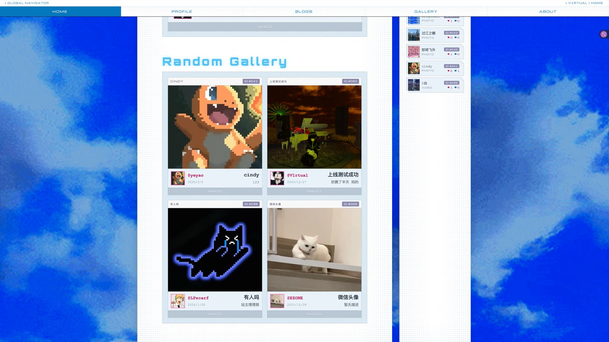

# V1rtual Frontend

V1rtual 个人网站前端。`V1rtualSS` 是当前站点版本分支，`main` 汇总已合并的稳定代码。

- Website: [https://v1rtual.top/](https://v1rtual.top/)
- Backend: [V1rtuallll/vvv-back-end](https://github.com/V1rtuallll/vvv-back-end/tree/V1rtualSS)

## 当前版本预览

<p align="center">
  
  
</p>

<p align="center">
  
  
</p>

## 功能

- 首页随机内容与首页配置展示。
- Gallery 的媒体浏览、上传、点赞和评论。
- 登录、个人资料、头像、用户名与密码维护。
- 管理员资源上传、OSS 同步、首页与媒体资源管理。
- 博客文章的阅读、目录锚点与正文渲染。
- 全局音效和站内音乐播放器。

页面按响应式设计，桌面端与移动端均可访问。

## 技术栈

| 类别 | 组件 |
| --- | --- |
| Framework | Vue 3 |
| Build | Vite 7 |
| Routing | Vue Router 4 |
| State | Pinia（`persistedstate` 负责持久化） |
| HTTP | Axios |
| Markdown | markdown-it |
| Test | Vitest + @vue/test-utils |

`package.json` 里的 `element-plus` 与 `cropperjs` / `vue-cropper` / `vue-cropperjs` 在 `src/` 下**零引用**，是遗留依赖；头像上传走的是原生 `<input type="file">`。不要假设它们可用。

## 目录

```text
src/
├── components/       # 消息提示、确认弹窗、上传队列、安全 HTML 渲染
│   └── layout/       # DefaultLayout 及其抽屉逻辑
├── modules/          # 按能力划分的 API 与 composable
│   ├── about/        # About 页面内容
│   ├── admin/        # 管理端资源与首页配置
│   ├── auth/         # 注册与登录
│   ├── blog/         # 博客文章与互动
│   ├── gallery/      # Gallery 媒体与互动
│   ├── home/         # 首页内容
│   ├── player/       # 全局音乐播放器
│   ├── upload/       # 上传队列
│   └── user/         # 用户资料与访客计数
├── shared/auth/      # 站点所有者判断
├── views/            # 页面编排（about / admin / blog / gallery / home / login / profile / register）
│   ├── blog/editor/          # 博客编辑器与其预览
│   ├── admin/components/     # 管理端表单、资源浏览与编辑弹窗
│   ├── blog/components/      # 卡片、评论区与配图选择
│   └── gallery/components/   # 上传、编辑、详情、BGM 与用户资料弹窗
├── router/           # 路由生成与守卫
├── stores/           # 登录状态
├── styles/           # CRT 主题
├── test/             # Vitest 全局 setup
└── utils/            # 请求、日期、Markdown、消毒、主题等工具
```

## 页面与请求边界

- `modules/*/api` 是页面请求的唯一入口，页面组件不直接调用 Axios。
- `modules/*/composables` 管理页面状态、请求编排和交互逻辑。
- `views/*` 负责页面组合；较复杂的 Gallery 和管理端交互位于各自的 `components/`。
- 管理端入口沿用用户名精确为 `V1rtual` 的判断，不引入角色系统。

## 本地运行

要求：Node.js `20.19+` 或 `22.12+`、pnpm，以及运行在 `8848` 的后端。

```bash
pnpm install
pnpm dev
```

开发服务器地址为 `http://localhost:3001`。前端请求 `/api`，由 Vite 代理到 `http://127.0.0.1:8848`。

```bash
pnpm build
```

该命令用于生产构建验证。

```bash
pnpm test
```

单元测试跑在 Vitest + jsdom 上，测试文件与被测文件同目录，命名 `<名字>.test.js`。纯样式、颜色、文案改动不需要配测试。

## 环境与发布

| Mode | API 行为 |
| --- | --- |
| development | `/api` 代理到 `http://127.0.0.1:8848` |
| production | 浏览器请求相对路径 `/api`，Nginx 负责转发 |

`.env.development` 和 `.env.production` 已提交，均不包含密钥。

每个分支代表一套完整网站版本。push 和 PR 只执行 CI 构建；部署由 GitHub Actions 手动选择分支执行。分支名按大版本对应：后端用大版本名（如 `V1rtualSS`），前端样式分支为 `大版本名_样式名`（如 `V1rtualSS_sky`）。前后端接口联动时，前端样式分支对应后端大版本分支，两边分别通过 CI 后再发布。

发布细节见 [CICD规范.md](CICD规范.md) 和 [skills/v1rtual-frontend-cicd](skills/v1rtual-frontend-cicd/SKILL.md)。
